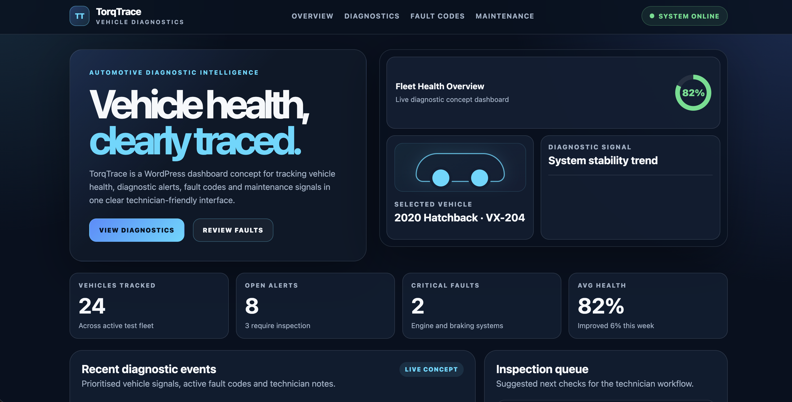
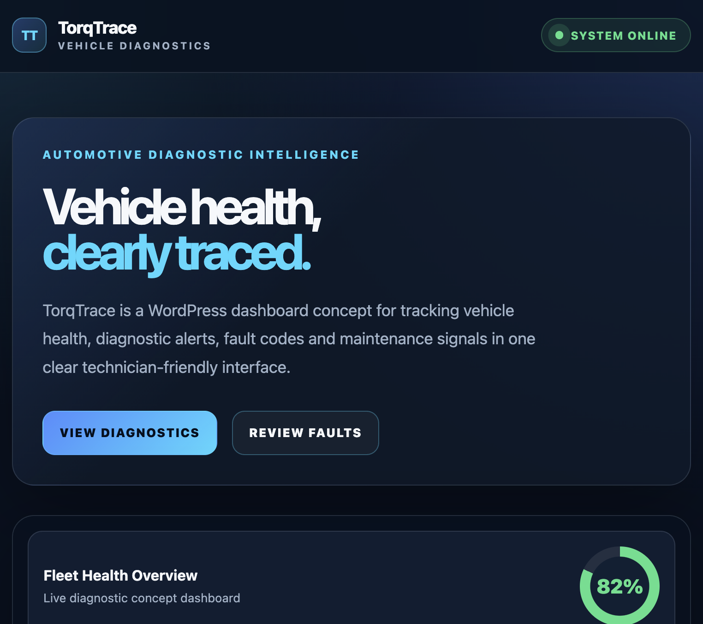
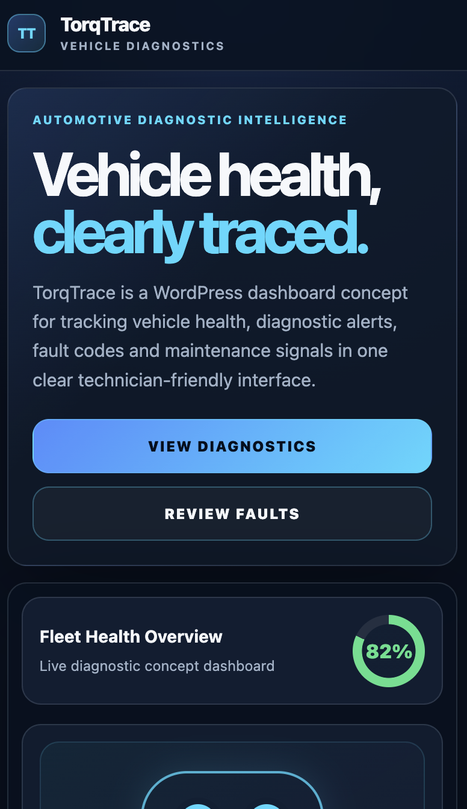
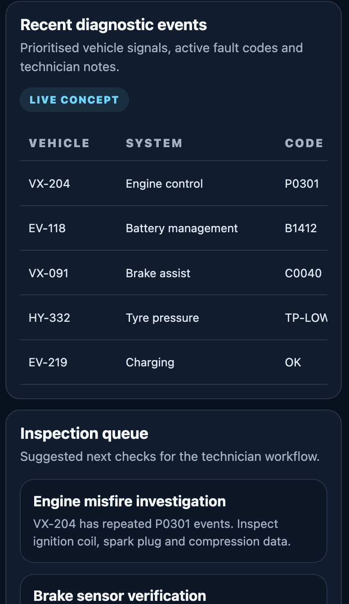

# TorqTrace

TorqTrace is a WordPress frontend dashboard concept for an automotive diagnostic interface.

It presents a technician-focused vehicle health dashboard with diagnostic metrics, vehicle status previews, recent fault codes, inspection priorities, and maintenance signals. The project was rebuilt as a polished WordPress theme concept to demonstrate responsive dashboard UI design, frontend structure, and visual product thinking.

## Current Version

**v1.0.0 — WordPress Dashboard Concept**

## Project Status

| Area | Status |
| --- | --- |
| WordPress theme structure | Complete |
| Custom front-page dashboard | Complete |
| Responsive desktop/tablet/mobile layout | Complete |
| Diagnostic metrics section | Complete |
| Vehicle health preview | Complete |
| Fault code table | Complete |
| Inspection queue | Complete |
| Maintenance signals | Complete |
| Screenshot-ready visual polish | Complete |

## Features

- Custom WordPress theme
- Static dashboard-style front page
- Automotive diagnostic UI concept
- Vehicle health overview
- Fleet diagnostic metrics
- Recent fault code table
- Inspection queue cards
- Maintenance signal cards
- Responsive mobile/tablet/desktop layout
- Dark technical interface styling

## Tech Stack

| Area | Technologies |
| --- | --- |
| CMS / Theme | WordPress, PHP |
| Frontend | HTML, CSS |
| UI | Responsive dashboard layout, cards, tables, status badges |
| Tools | LocalWP, Git, GitHub, VS Code |

## Project Structure

```text
torqtrace/
  README.md
  LICENSE
  docs/
  archive/
    vite-version/
      src/
      public/
      package.json
      vite.config.ts
      tsconfig.json
      tsconfig.app.json
      tsconfig.node.json
      eslint.config.js
      index.html
  wordpress/
    torqtrace-theme/
      footer.php
      front-page.php
      functions.php
      header.php
      index.php
      style.css
      theme.json
```

## WordPress Theme Files

| File | Purpose |
| --- | --- |
| `style.css` | Theme metadata and full responsive dashboard styling |
| `functions.php` | Theme setup, title support, HTML5 support, menu registration, and stylesheet enqueueing |
| `header.php` | Site header, logo, navigation, and system status indicator |
| `footer.php` | Site footer and WordPress footer hook |
| `index.php` | Fallback WordPress template |
| `front-page.php` | Main TorqTrace dashboard concept |
| `theme.json` | WordPress theme configuration |

## Local WordPress Setup

This theme was tested locally using LocalWP.

To preview the theme:

1. Create a local WordPress site in LocalWP.
2. Copy or symlink `wordpress/torqtrace-theme` into the local WordPress themes directory:

```text
wp-content/themes/
```

3. Activate **TorqTrace** in WordPress:

```text
Appearance → Themes → TorqTrace → Activate
```

4. Visit the local homepage.

The theme uses `front-page.php` as the main dashboard layout.

## Suggested Symlink Setup

If the repository is stored locally and you want changes in the repo to update immediately in LocalWP, you can symlink the theme folder.

Example:

```bash
ln -s ~/Developer/torqtrace/wordpress/torqtrace-theme \
  ~/Local\ Sites/torqtrace/app/public/wp-content/themes/torqtrace-theme
```

Adjust the paths if your local folders are different.

## Screenshots

<table>
  <tr>
    <td>
      
      <br/>
      <strong>Desktop Dashboard Hero</strong>
    </td>
    <td>
      
      <br/>
      <strong>Tablet Dashboard Hero</strong>
    </td>
  </tr>
  <tr>
    <td>
      
      <br/>
      <strong>Mobile Dashboard Hero</strong>
    </td>
    <td>
      
      <br/>
      <strong>Mobile Dashboard</strong>
    </td>
  </tr>
</table>

## Previous Version

The original React / TypeScript / Vite version has been archived in:

```text
archive/vite-version/
```

That version remains available for reference, but the active v1.0.0 release is the WordPress dashboard concept.

## Release Notes

### v1.0.0

- Rebuilt TorqTrace as a WordPress frontend dashboard concept
- Added a custom WordPress theme structure
- Added a dashboard-style `front-page.php`
- Added responsive desktop, tablet, and mobile styling
- Added diagnostic metrics, vehicle health preview, fault-code table, inspection queue, and maintenance cards
- Archived the previous React / TypeScript / Vite version

## Author

Built by Iris408.